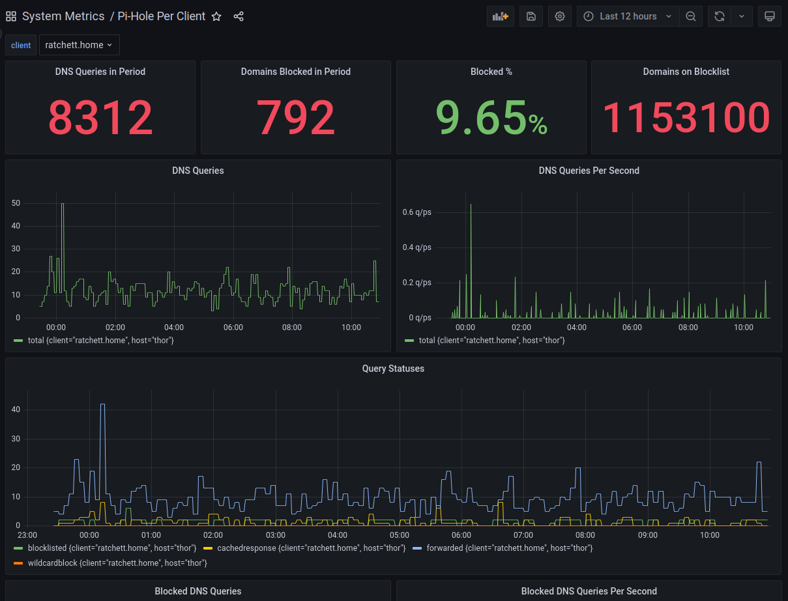

# Per Client Pi-Hole stats for Telegraf

This `exec` plugin for [Telegraf](https://github.com/influxdata/telegraf) collects statistics from [Pi-Hole's](https://pi-hole.net/) API in order to expose *per-client* statistics on block-rates.

----

### System Wide Stats

Before creating this plugin, I already collected stats from Pi-Hole using a HTTP input like the one [described here](https://www.alteredtech.io/posts/pihole-telegraph/)
```ini
 [[inputs.http]]
     #pihole URL for data in json format
     urls=["http://x.x.x.x:8080/admin/api.php"]

     method = "GET"

     #Overwrite measurement name from default http to pihole_stats
     name_override = "pihole_stats"

     #exclude host items from tags
     tagexclude = ["host"]

     #data from http in JSON format
     data_format = "json"

     #JSON values to set as string fields
     json_string_fields = ["url","status"]

     insecure_skip_verify = true
```
So, this plugin doesn't attempt to reimplement those.

----

### Deploying and Configuring

The script should be saved somewhere that Telegraf can find it (I tend to use `/usr/local/src/telegraf_plugins/`).

At the head of the script are some configuration items
```python
# Pihole connection info
PIHOLE_ADDRESS="http://127.0.0.1:8080"

# Auth token
# get this from settings -> API -> Show API Token
PIHOLE_TOKEN=""

# How many minutes of Pihole logs to query on each
# iteration
QUERY_TIME_RANGE=15

# The measurement name to use in output LP
MEASUREMENT="pihole_clients"
```

----

### Telegraf Config File

The plugin simply needs to be referenced in an exec plugin statement:
```ini
[[inputs.exec]]
    commands = [
        "/usr/local/src/telegraf_plugins/pihole-granular-stats.py"
    ]
    timeout = "60s"
    interval = "5m"
    name_suffix = ""
    data_format = "influx"
```
    
----

### Stats

Default Measurement: `pihole_clients`
tags: `client`

Fields:

* blocklisted
* forwarded
* cachedresponse
* wildcardblock
* total

----

### Graphing

This repo contains an example [Grafana Dashboard](grafana/Pi-Hole_Per_Client.json)




----

### Copyright

Copyright (c) 2023 [Ben Tasker](https://www.bentasker.co.uk)

Released under [GNU GPL v3](https://www.gnu.org/licenses/gpl-3.0.txt)
