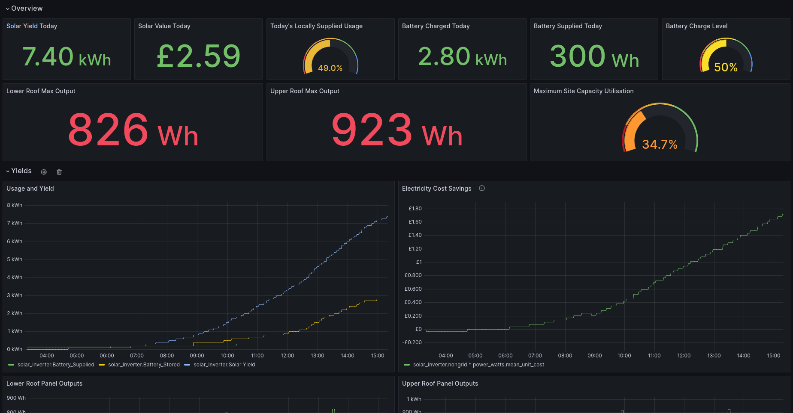

### Soliscloud Telegraf Plugin

This is an exec based plugin for Telegraf designed to collect Electricity usage and generation statistics from [Soliscloud](https://www.soliscloud.com/). Inverters, Dataloggers, EPMs and Meters made by [Ginlong Technologies](https://www.ginlong.com/) tend to report  into Soliscloud.

This plugin calls the Soliscloud API in order to retrieve information so that [Telegraf](https://github.com/influxdata/telegraf) can write it into InfluxDB for easy visualisation.



More information on the original development can be found in [utilities/telegraf-plugins#9](https://projects.bentasker.co.uk/gils_projects/issue/utilities/telegraf-plugins/9.html)


----

### Dependencies

* Python >= 3
* Python Requests Module

----

### Pre-Requisites

You will need API access, but this is not enabled by default.

As [detailed here](https://solis-service.solisinverters.com/support/solutions/articles/44002212561-api-access-soliscloud) you'll need to raise a support ticket requesting access (mine was acted on promptly).

Once API access has been enabled for your account, instructions will be given on how to generate credentials. This will result in you having

* An API domain 
* An API Key ID 
* An API Secret


----

### Telegraf Config

The API details can be passed via the `environment` configuration option

```ini
[[inputs.exec]]
    commands = [
        "/usr/local/src/telegraf_plugins/soliscloud.py",
    ]
    timeout = "60s"
    interval = "5m"
    name_suffix = ""
    data_format = "influx"
    environment = [
    "API_ID=",
    "API_SECRET=",
    "API_URL=https://www.soliscloud.com:13333"    
    ]
```

----

### Example Output

```
solar_inverter,type=device,device_type=battery,inverter_id=123456,inverter_sn=78901112,station=13141516178,userId=1920212223,batteryType=1.0,influxdb_database=Systemstats,batteryState=charging batteryPowerUnit="kW",batteryPowerPerc=46.0,batteryHealthPerc=100.0,batteryCurrentStr="A",batteryTodayChargeEnergy=2.5,batteryTodayChargeEnergyStr="kWh",batteryTodayDischargeEnergy=0.3,batteryTodayDischargeEnergyStr="kWh",readingAge=6i,batteryVoltage=50.6,batteryChargeRate=0.612,batteryDischargeRate=0.0,batteryCurrent=12.1
solar_inverter,type=device,device_type=inverter,inverter_id=123456,inverter_sn=78901112,station=13141516178,userId=1920212223,inverter_model=3101,influxdb_database=Systemstats state=3,todayYield=6.4,todayYieldStr="kWh",power_ac=1.097,power_ac_str="kW",temperature=36.8,gridBuyToday=5.0,gridSellToday=0.0,batterySupplyToday=0.3,batteryChargeToday=2.5,readingAge=6i,stationCapacity=3.28,stationCapacityUsedPerc=38.0,consumptionToday=10.0,panel_1=558.0,panel_2=540.0,panel_3=0.0,panel_4=0.0,panel_5=0.0,panel_6=0.0,panel_7=0.0,panel_8=0.0,panel_9=0.0,panel_10=0.0,panel_11=0.0,panel_12=0.0,panel_13=0.0,panel_14=0.0,panel_15=0.0,panel_16=0.0,panel_17=0.0,panel_18=0.0,panel_19=0.0,panel_20=0.0,panel_21=0.0,panel_22=0.0,panel_23=0.0,panel_24=0.0,panel_25=0.0,panel_26=0.0,panel_27=0.0,panel_28=0.0,panel_29=0.0,panel_30=0.0,panel_31=0.0
```

----

### Fields

Note: many of the fields are accompanied by a field denoting the unit (for example `batteryCurrent` and `batteryCurrentStr`). These are drawn from the API and (appear) to be drawn from localisation settings in the user's Soliscloud profile.


`device_type=battery`

- `batteryPowerPerc`: percentage charge of the battery
- `batteryHealthPerc`: The batteries internal assessment of it's health vs manufacturer lifetime expectations
- `batteryTodayChargeEnergy`: Amount of energy (usually `kWh`) pushed into the battery today
- `batteryTodayDischargeEnergy`: Amount of energy (usually `kWh`) drawn from the battery today
- `readingAge`: how long ago (in seconds) since the inverter reported these stats into soliscloud
- `batteryVoltage`: Current battery voltage
- `batteryChargeRate`: Current rate at which the battery is being charged (usually `kW`)
- `batteryDischargeRate`: Current rate at which the battery is discharging (usually `kW`)
- `batteryCurrent`: Current in/out of the battery (usually in `A`)


`device_type=inverter`

- `state`: a numerical indicator of the inverter's state (online, offline, alarm). There is [a mismatch](https://projects.bentasker.co.uk/gils_projects/issue/utilities/telegraf-plugins/9.html#comment4649) between observed values and those in the API docs, so it's recommended that any monitoring watch for changes in value
- `todayYield`: Energy generated by solar panels
- `power_ac`:  current power output of inverter (normally `kW`)
- `temperature`: Ambient temperature 
- `gridBuyToday` : Energy taken from the grid today
- `gridBuyTotal` : Total Energy taken from the grid
- `gridSellToday`: Energy exported to the grid today
- `gridSellTotal`: Total Energy exported to the grid
- `batterySupplyToday`: Energy supplied by the battery today
- `batteryChargeToday`: Energy stored/charged into the battery today
- `readingAge`: how long ago (in seconds) since the inverter reported these stats into soliscloud
- `stationCapacity`: Installed solar capacity (usually in `kWp`)
- `stationCapacityUsedPerc`: Currently realised percentage of installed capacity
- `consumptionToday`: Total energy consumed today from all sources
- `consumptionTotal`: Total energy consumed from all sources
- `consumption`: Total energy currently being consumed from all sources
- `panel_1`..`panel_31`: Current energy output (usually in `W`) of each solar string
- `localSupplyToday`: value (in kWh) of energy supplied locally today
- `localSupplyPercToday`: Percentage of consumed energy supplied locally today
- `localSupplyTotal`: Total kWh supplied by local sources
- `localSupplyPercTotal`: Percentage of total consumed energy supplied by local sources


----

### Unexpected Initial Values

It's been observed (in [utilities/telegraf-plugins#9](https://projects.bentasker.co.uk/gils_projects/issue/utilities/telegraf-plugins/9.html#comment4648) and [utilities/telegraf-plugins#10](https://projects.bentasker.co.uk/gils_projects/issue/utilities/telegraf-plugins/10.html#comment4661)) that the Soliscloud API can report unexpectedly high values for some counters on the first day that a reading is registered for that particular counter.

The following counters have been observed to do this

- `gridBuyToday` (will usually be the first day that the inverter is online)
- `gridSellToday` (may occur later - it'll be the first day that energy is actually exported to the grid)

After the first day's high values, readings appear to normalise and report correctly.

Oddly the corresponding "Total" fields are unaffected, so on the first day, `gridBuyTotal` and `gridSellTotal` can be used to obtain a more accurate read.


----

### License

Copyright 2023, B Tasker. Released under [BSD 3 Clause](https://www.bentasker.co.uk/pages/licenses/bsd-3-clause.html).
